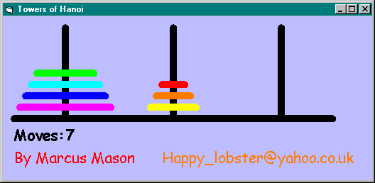



## Towers Of Hanoi Game

### Description

Play the Towers Of Hanoi game! Move the stack of discs from the left peg, to any of the other 2. You can only move one disc at a time and you cannot put larger discs on smaller ones. You've bound to have seen this game before! Give it a try - my lowest score is 65.
 
### More Info
 

             |
---                |---
**Submitted On**   |2000-10-15 21:43:54
**By**             |[Marcus Mason](https://github.com/Planet-Source-Code/PSCIndex/blob/master/ByAuthor/marcus-mason.md)
**Level**          |Intermediate
**User Rating**    |4.3 (13 globes from 3 users)
**Compatibility**  |VB 4\.0 \(32\-bit\), VB 5\.0, VB 6\.0
**Category**       |[Games](https://github.com/Planet-Source-Code/PSCIndex/blob/master/ByCategory/games__1-38.md)
**World**          |[Visual Basic](https://github.com/Planet-Source-Code/PSCIndex/blob/master/ByWorld/visual-basic.md)
**Archive File**   |[CODE\_UPLOAD1068010152000\.zip](https://github.com/Planet-Source-Code/marcus-mason-towers-of-hanoi-game__1-12077/archive/master.zip)

